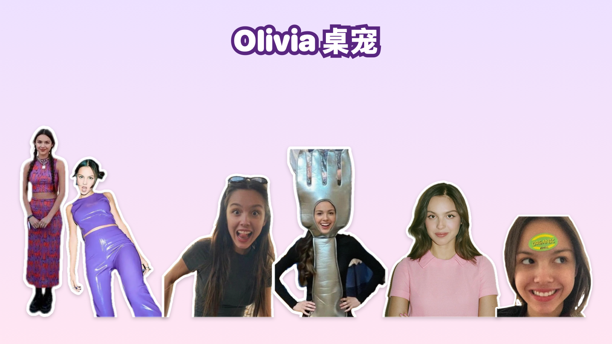

# Olivia 桌宠

把 Olivia Rodrigo 做成了 Mac 桌宠：她平时是一张表情包贴纸，站在你的桌面上走来走去，会理你、会睡觉、能被拎起来扔出去，点一下按钮还能演她的各种名场面



> 粉丝向的非官方作品，与 Olivia Rodrigo 本人及其团队、唱片公司没有任何关系

## 按钮

她头顶有一排按钮：

| 按钮 | 作用 |
|---|---|
| 搞笑娅娅 | 在 4 张搞笑表情包之间切换 |
| 萌娅娅 | 在 5 张萌系自拍之间切换 |
| 荡秋千 | 在原地荡秋千，从左往右荡 |
| 发疯 | 弹出菜单选一段发疯名场面：Good 4 U 火烧房间、全美婊 1（砸蛋糕）、全美婊 2（坐在桌上唱）、VMA 砸玻璃，也可以随机来一个 |
| 抓马抓马 | 录音棚里唱 drama drama |
| 思念棉夫 | thank you L 采访名场面（带原视频字幕） |
| 散步 | 闲着的时候自己在屏幕底部走来走去 |
| 竖屏 | 只在屏幕最右边 9:16 的竖条里活动，方便录竖屏视频 |

她右脚边还有一个「唱 Good 4 U」按钮，点一下她就站在原地跟着 VMA 现场版唱起来

名场面都带原视频的声音，Good 4 U 带中英歌词字幕；演的时候脚边会出现「停止」按钮，按钮条会自动挪到画面外面，不挡着她

## 互动

| 怎么做 | 她会怎样 |
|---|---|
| 拖着她走 | 像被拎住一样左右晃，喊「放我下来」，停一下再松手，她就待在你放的位置 |
| 用力甩出去 | 飞出去、撞到屏幕边弹回来、落地压扁，摔得高了会头晕 |
| 鼠标在她上半身左右蹭 | 摸头：冒小爱心，换成开心的表情 |
| 鼠标靠近她 | 发现你了：跳一下、头上冒感叹号，身体往鼠标那边歪 |
| 连戳她 5 下 | 被惹毛了，随机发一段疯 |
| 什么都不做 | 她会自己说话、做鬼脸、转圈、跳到窗口顶上走来走去，偶尔还会自己演一段名场面 |
| 3 分钟不碰电脑 | 她睡着了，头上冒 Zzz，你一回来她就伸个懒腰跟你打招呼 |

右键她可以：调大小、开关声音、开关重力（关掉后拖到哪就停在哪，不会掉下来）、开关睡觉、设置多久自己演一次名场面、打开录屏背景（一键遮住桌面上的窗口和图标只留壁纸，或者换成绿幕方便后期抠图）、退出

## 下载安装

1. 到本仓库右侧的 **Releases** 下载 `olivia-pet-mac.zip`
2. 解压后把「Olivia桌宠」拖进「应用程序」文件夹
3. 第一次打开会被系统拦下（这个 app 没有付费做苹果签名），这样放行：
   - 先双击打开一次，弹窗里点「完成」
   - 打开「系统设置 → 隐私与安全性」，拉到最下面，点「仍要打开」
4. 打开后她会出现在屏幕右下角，没有 Dock 图标，退出请右键她

系统要求：macOS 13 及以上，Apple 芯片和 Intel 芯片的 Mac 都可以用

## 自己编译

需要先装 Xcode 或 Xcode 命令行工具（终端运行 `xcode-select --install`），然后在项目目录里运行：

```bash
./build.sh
```

打包好的 app 在 `build/Olivia桌宠.app`，下载用的压缩包在 `build/olivia-pet-mac.zip`

## 素材是怎么做的

`assets/` 里是已经处理好的素材，编译时直接用；原视频和原图没有放进仓库，想重新生成可以把它们放进 `source/`，然后运行 `./make_assets.sh`（文件名和每段视频的裁切参数见脚本里的注释）

- 表情包：用 macOS 自带的主体识别把人抠出来，加一圈白色贴纸描边
- 名场面：逐帧用主体识别找到她并跟踪，别人和杂物都去掉；镜头远近不同的片段按脸的大小统一缩放，接起来不会忽大忽小；原视频的歌词字幕单独抠出来再叠回去
- 荡秋千：原视频是手机仰拍的天空背景，先防抖，再用所有帧算出「没有人的空背景」来抠图，秋千链子太细抠不出来，是照着视频重新画的
- 加速：太长的名场面用变速不变调加快，画面和声音一起加快，内容不剪

## 项目结构

```
app/main.swift            桌宠本体（Swift + AppKit，单文件）
assets/                   处理好的贴纸、逐帧透明动画、声音、字幕
tools/stickers.swift      表情包照片 → 白边贴纸
tools/scene.swift         名场面视频 → 透明逐帧动画（主体识别、跟踪、统一大小、抠字幕）
tools/swing.swift         荡秋千视频专用：防抖 + 空背景抠图 + 画链子
tools/audioonly.swift     只要一段视频的声音
tools/audiofix.swift      统一音量、变速不变调
tools/edges.swift.inc     抠图共用的收边处理
tools/audio.swift.inc     声音处理共用的部分
tools/icon.swift          生成 app 图标
tools/preview.swift       生成本页顶部的预览图
build.sh                  编译打包
make_assets.sh            从原视频、原图重新生成素材
```

## 素材来源与版权

- Olivia Rodrigo 的肖像、照片、MV 和演出画面、音乐与音频，版权和肖像权归她本人及相关权利方（唱片公司、电视台、媒体）所有
- 用到的画面来自 Good 4 U MV、SNL 和 MTV VMA 的演出片段、drama drama 翻唱视频、thank you L 采访，以及小红书、抖音网友分享的表情包和剪辑
- 本项目仅供粉丝交流和学习，不得用于商业用途；如果你是相关权利方并希望删除素材，请提 Issue 联系，会尽快处理
- 代码部分以 MIT 协议开源，见 [LICENSE](LICENSE)，素材不在开源协议范围内

## 制作过程

整个桌宠是用 [Claude Code](https://claude.com/claude-code) vibe coding 做出来的：从抠图、防抖、字幕提取，到桌宠的动画、物理和各种互动，都是通过对话一步步完成的，它的「前辈」是 [biubiu 小猫桌宠](https://github.com/gabrielxie55/biubiu-cat)
